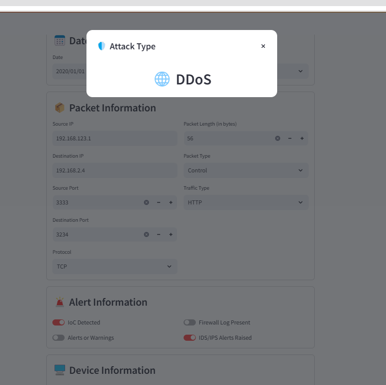

# Cyber-Attack Predictor

Cyberattacks have become an omnipresent threat in today's digital landscape, thus new ways are exploited to minimize the risk of these attacks. As AI and Machine Learning (ML) technologies continue to evolve, researchers are investigating innovative approaches to counteract and reduce the impact of these attacks. In this, we are going to apply Machine Learning techniques over a synthetic dataset containing three different types of cyber-attacks: DDoS, Malware, and Intrusion, and develop a web application to predict the attack type.

## Setting up Environment

### Conda Environment Setup
Ensure you have Conda installed. The recommended version for this project is Conda 24.9.2.

To create the environment, run:
```sh
conda env create -f environment.yml
```

Conda will also install the required Python dependencies automatically.

### Installing Python Dependencies (if not using Conda)
Ensure you have Python 3.10 installed. If Conda is not used, install the required dependencies manually:
```sh
pip install -r requirements.txt
```

### Running Notebooks
To run the notebooks, select the virtual environment (venv) created during setup.

### Running the Application
To launch the web application, use Streamlit:
```sh
streamlit run ./src/main.py
```

### Web Application Preview
Below is an example demos of the web application:
[Watch the live demo](./media/videos/web_app_demo.mp4)
#### Web Application Screen shot



